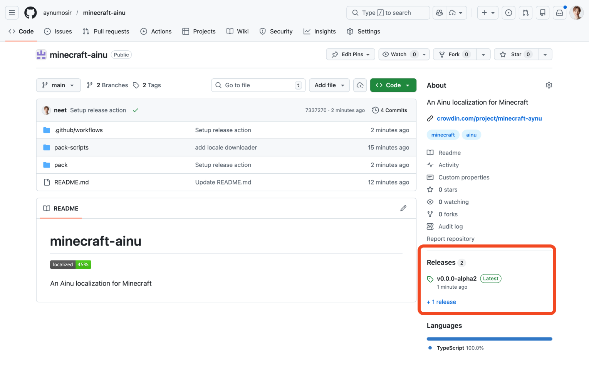
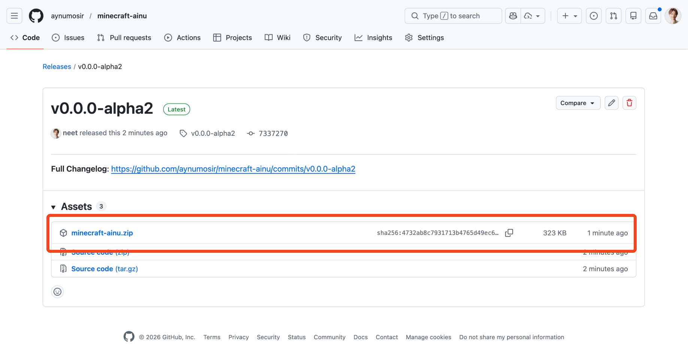
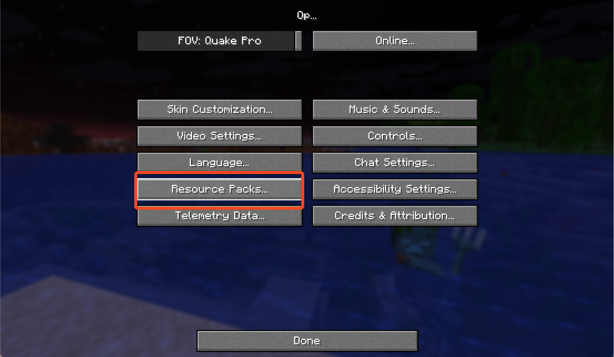
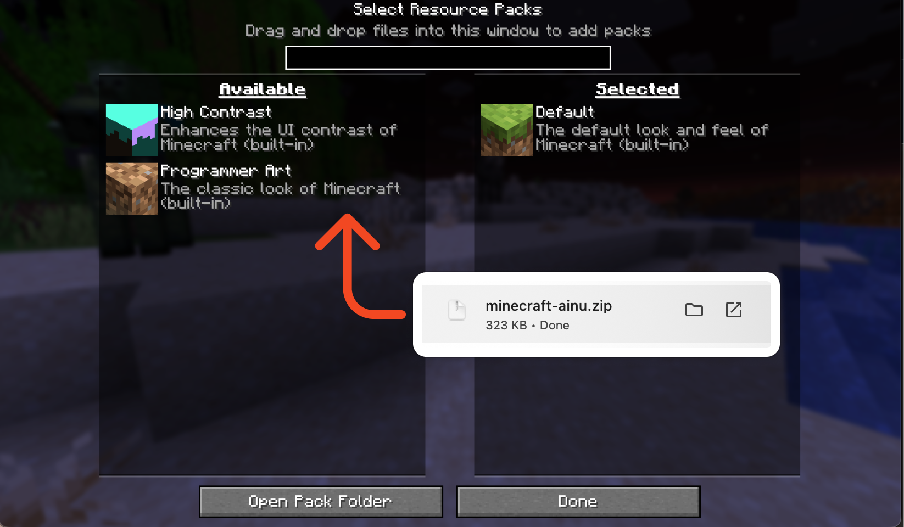
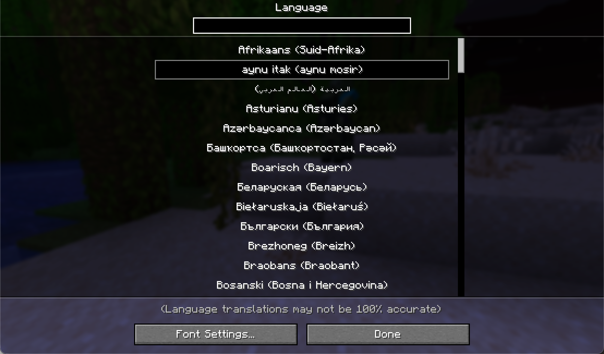

# minecraft-ainu

An Ainu localization for Minecraft

## Script Escapes

Kana generation preserves certain tokens and escape patterns:

- Protected text escape: wrap text in `-{...}-` to keep the inner text unconverted while removing the markers.
  - Example: `-{Copyright}- Aynumosir.` → `Copyright　アイヌモシㇼ。`
- Format tokens: `%s`, `%d`, `%f` (with optional positional specifiers like `%1$s`) are preserved.
  - Example: `%s TEST` → `%s　TEST`
- Acronyms: all-uppercase words are preserved.
  - Example: `LAN or ta maka` → `LAN　オㇿ　タ　マカ`

## Installation

First, open the **Releases** page from the bottom-right of this page.

You will see the latest release. Click **minecraft-ainu.zip** to download the resource pack.

Open Minecraft, then click **Options > Resource Packs…** to see the list of installed resource packs.

Next, drag and drop the **minecraft-ainu.zip** file you just downloaded.

Now you can switch to the Ainu language. Open **Options > Language…** and select **aynu itak (aynu mosir)** to activate it. Enjoy!

